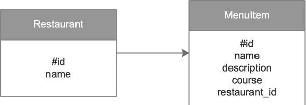

# Restaurant Project - Python & Flask   
   

## Description   
This is a project developed in `Python` & `Flask`, for a restaurant, to shows the menus and allows CRUD operations.   
> **CRUD**: **C**reate, **R**ead, **U**pdate & **D**elete   

## Repository Contents   
All file for the GitHub pages site reside in the project folder:

| Folder    | Contains                                                                                 |
|:---       |:---                                                                                      |
| static    | All static data as: javascript (`.js`), style sheets (`.css`), and images (`.png`) files |
| templates | All .html templates                                                                      |  

## Install   
1. Fork the project in a local folder in your computer.
2. Run the app: open the `Terminal`, go to the folder in which the downloaded information is located, and use the following command:   
`$ python restaurant.py`   

## Language   
Python 3

## Restaurants DB Design    

This app has been developed    

The DataBase design is:   

### Restaurant Table   

| Field  | Description           |
|:---    |:---                   |
| id     | unique key identifier |
| name   | restaurant name       |

### Menu Item Table   

| Field         | Description                                                              |
|:---           |:---                                                                      |
| id            | unique key identifier                                                    |
| name          | item name                                                                |
| price         | item price                                                               |
| description   | item description                                                         |
| course        | categorize whether it is it is an appetizer, entree, dessert or beverage |
| restaurant_id | foreign key, from restaurant id                                          |

